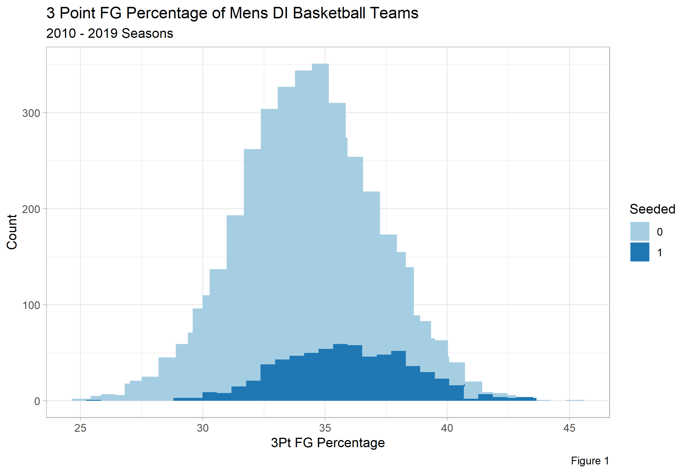
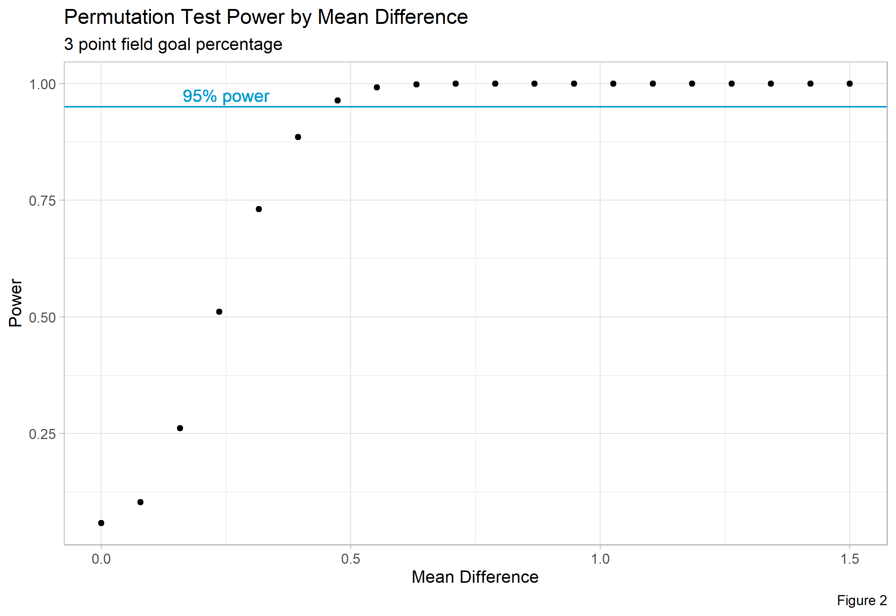
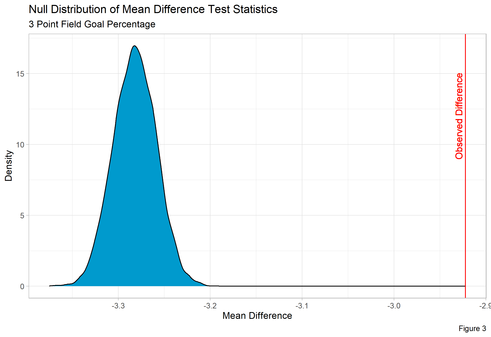

# March Madness

In this project, we analyze differences in performance metrics for collegiate basketball teams that have qualified for March Madness versus those that have not using a variety of Monte Carlo Simulation methods in R. 

## Medium Article

## Brief Executive Overview
### Intro
The aim of this analyis is to identify if the *distributions* of collegiate basketball metrics differ in teams that qualify for March Madness versus those that do not.
This is done by employing a 2-sample permuational t-test with a difference of means test statistic (). 
We justify it's use in *Simulations* and apply the test in *Analysis*.

### Data
Data used here comes from  over the 2010-2019 seasons. The features are a collection of effeciency and miscellaneous stats over those
seasons. Because these files were downloaded only as a result of a paid subscription, I don't find it appropriate to make them publicly available. Feel free to 
[contact me](mailto:dimsirov@umich.edu) regarding any questions about data or reproducibility. The feature of focus in the article is 3 point field goal percentage and
is distributed like so:

### Simulation
In this section, we find that our test has at least 95% power with an observed mean difference of +/- 0.5 or greater. In other words, if the observed mean difference is
at least 0.5 in magnitude, the probability of rejecting our null hypothesis when it is *not* true is approximately 95% or greater. Permutation tests, by design, also
have size no greater than a given alpha level (in this case, 5%), meaning the probability of rejecting our null hypothesis when it *is* true is no higher than 5%. 
This tells us that we can be confident in our results.

### Analysis
Performing our 2-sample permutational t-test shows us that our observed mean difference is approximately -2.9 and is significantly distant from our null distribution. 
In other words, the labels of "seeded" and "non-seeded" *do* make a difference in our observed data than compared to if the labels were randomly assigned. We then
conclude that the distribution of 3 point field goal percentage for seeded versus non-seeded teams do in fact differ.

### Moving Forward
Since we've identified that the distributions are different we can move to approximate these distributions with .
We could also build and compare a variety of classification models (SVM, Logistic Regression, Random Forest, KNN, etc) to predict if a team will receive a seed for
March Madness given performance metrics in the regular season.
